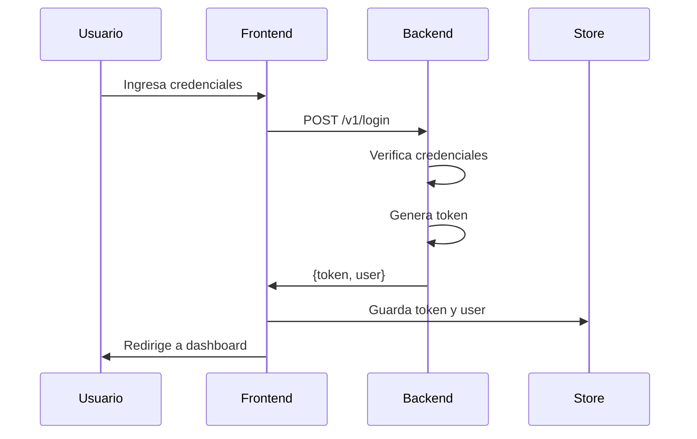
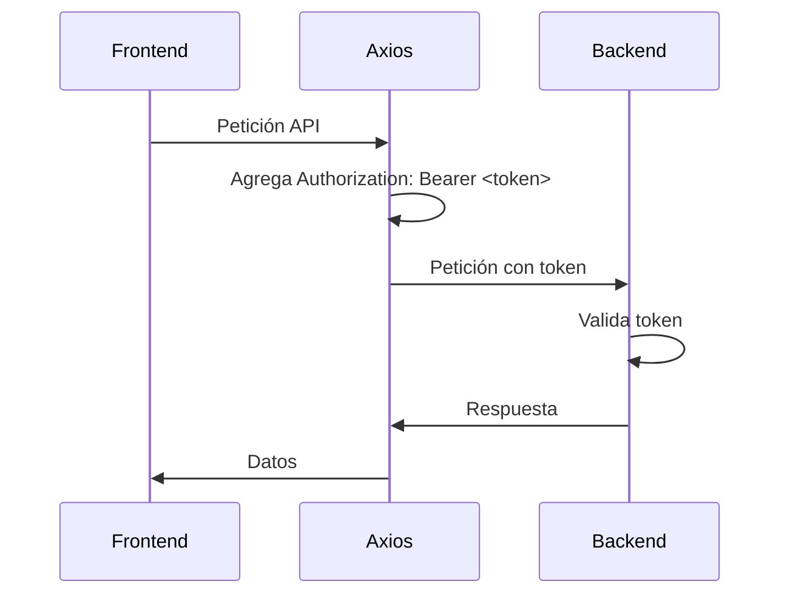
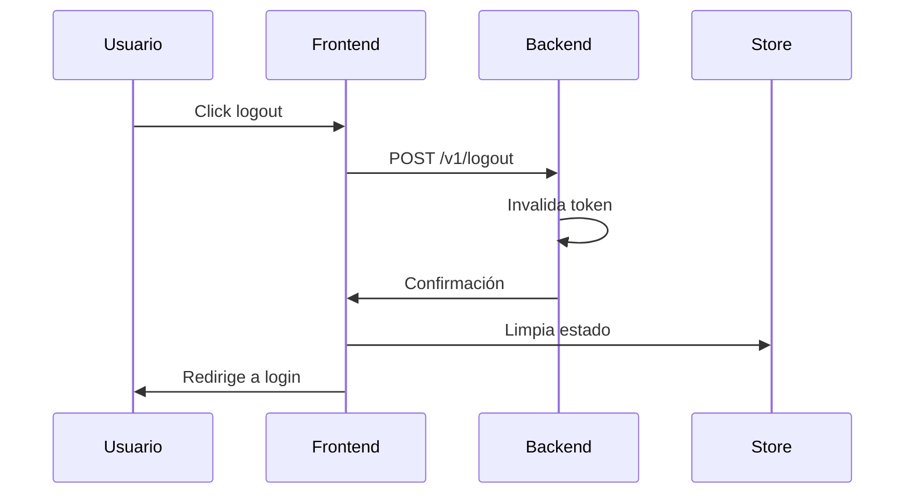

# Implementación del Login con Microservicio de Tokens

## Resumen

Se ha implementado completamente el login usando el nuevo microservicio de autenticación basado en tokens API. El sistema es simple, confiable y está listo para producción.

## Componentes Implementados

### 🔧 Backend (Laravel Sanctum)

#### AuthController
```php
// app/Http/Controllers/Api/V1/AuthController.php
class AuthController extends Controller
{
    public function login(LoginRequest $request)
    {
        // Verificar credenciales
        $user = User::where('email', $request->email)->first();
        
        if (!$user || !Hash::check($request->password, $user->password)) {
            throw ValidationException::withMessages([
                'email' => ['Las credenciales proporcionadas son incorrectas.'],
            ]);
        }

        // Revocar tokens previos y generar nuevo
        $user->tokens()->delete();
        $token = $user->createToken('auth-token')->plainTextToken;

        return response()->json([
            'token' => $token,
            'user' => new UserResource($user->load('roles.permissions', 'institucion')),
        ]);
    }

    public function logout(Request $request)
    {
        $request->user()->currentAccessToken()->delete();
        return response()->json(['message' => 'Sesión cerrada exitosamente']);
    }

    public function me(Request $request)
    {
        return response()->json([
            'user' => new UserResource($request->user()->load('roles.permissions', 'institucion')),
        ]);
    }
}
```

#### Rutas
```php
// routes/api.php
Route::prefix('v1')->group(function () {
    // Público
    Route::post('/login', [AuthController::class, 'login']);
    
    // Protegido con auth:sanctum
    Route::middleware('auth:sanctum')->group(function () {
        Route::post('/logout', [AuthController::class, 'logout']);
        Route::get('/me', [AuthController::class, 'me']);
        // ... otras rutas protegidas
    });
});
```

### 🎨 Frontend (React + TypeScript)

#### Store de Autenticación
```typescript
// src/store/authStore.ts
interface AuthState {
  user: User | null
  token: string | null
  isAuthenticated: boolean
  login: (email: string, password: string) => Promise<void>
  logout: () => void
}

export const useAuthStore = create<AuthState>()(
  persist(
    (set, get) => ({
      user: null,
      token: null,
      isAuthenticated: false,

      login: async (email: string, password: string) => {
        const response = await axiosClient.post('/login', {
          email,
          password,
        })
        const { token, user } = response.data
        set({ user, token, isAuthenticated: true })
      },

      logout: async () => {
        try {
          await axiosClient.post('/logout')
        } catch (error) {
          console.error('Error en logout:', error)
        } finally {
          set({ user: null, token: null, isAuthenticated: false })
        }
      },
    }),
    { name: 'auth-storage' }
  )
)
```

#### Cliente Axios
```typescript
// src/api/axiosClient.ts
const axiosClient = axios.create({
  baseURL: API_CONFIG.baseURL,
  timeout: API_CONFIG.timeout,
  headers: API_CONFIG.headers,
})

// Interceptor automático para agregar token
axiosClient.interceptors.request.use((config) => {
  const token = useAuthStore.getState().token
  if (token) {
    config.headers.Authorization = `Bearer ${token}`
  }
  return config
})

// Manejo de errores 401
axiosClient.interceptors.response.use(
  (response) => response,
  async (error) => {
    if (error.response?.status === 401) {
      useAuthStore.getState().logout()
      window.location.href = '/login'
    }
    return Promise.reject(error)
  }
)
```

#### Componente de Login
```typescript
// src/components/auth/LoginForm.tsx
const LoginForm = ({ onSuccess, redirectTo = '/dashboard' }: LoginFormProps) => {
  const [email, setEmail] = useState('')
  const [password, setPassword] = useState('')
  const [loading, setLoading] = useState(false)
  
  const navigate = useNavigate()
  const { login } = useAuthStore()
  const { showSuccess, showError } = useAlertContext()

  const handleSubmit = async (e: React.FormEvent) => {
    e.preventDefault()
    setLoading(true)

    try {
      await login(email, password)
      showSuccess('Inicio de sesión exitoso', 'Bienvenido al sistema')
      
      if (onSuccess) onSuccess()
      navigate(redirectTo)
      
    } catch (err: any) {
      const errorMessage = err.message || 'Credenciales inválidas'
      showError(errorMessage, 'Error de autenticación')
    } finally {
      setLoading(false)
    }
  }

  return (
    <Card className="shadow-xl">
      <CardHeader>
        <h2 className="text-xl font-semibold text-gray-900 text-center">
          Iniciar Sesión
        </h2>
      </CardHeader>
      <CardBody>
        <form onSubmit={handleSubmit} className="space-y-6">
          <Input
            label="Correo Electrónico"
            type="email"
            value={email}
            onChange={(e) => setEmail(e.target.value)}
            required
            disabled={loading}
          />
          <Input
            label="Contraseña"
            type="password"
            value={password}
            onChange={(e) => setPassword(e.target.value)}
            required
            disabled={loading}
          />
          <Button type="submit" loading={loading} className="w-full">
            {loading ? 'Iniciando sesión...' : 'Iniciar Sesión'}
          </Button>
        </form>
      </CardBody>
    </Card>
  )
}
```

#### Hook de Logout
```typescript
// src/hooks/useLogout.ts
export const useLogout = () => {
  const navigate = useNavigate()
  const { logout } = useAuthStore()
  const { showSuccess, showError } = useAlertContext()

  const handleLogout = useCallback(async () => {
    try {
      await logout()
      showSuccess('Sesión cerrada exitosamente', 'Hasta pronto')
      navigate('/login')
    } catch (err: any) {
      showError(err.message || 'Error al cerrar sesión', 'Error de logout')
      navigate('/login')
    }
  }, [logout, navigate, showSuccess, showError])

  return { logout: handleLogout }
}
```

## Flujo de Autenticación

### 1. Login


### 2. Peticiones Autenticadas


### 3. Logout


## Endpoints de la API

### POST /api/v1/login
**Público** - Inicia sesión y devuelve token

**Request:**
```json
{
  "email": "admin@example.com",
  "password": "123456"
}
```

**Response (200):**
```json
{
  "token": "1|abcdefg12345...",
  "user": {
    "id": 1,
    "nombre": "Admin",
    "apellido": "Sistema",
    "email": "admin@example.com",
    "roles": [...],
    "institucion": {...}
  }
}
```

### POST /api/v1/logout
**Protegido** - Cierra sesión invalidando token

**Headers:**
```
Authorization: Bearer 1|abcdefg12345...
```

**Response (200):**
```json
{
  "message": "Sesión cerrada exitosamente"
}
```

### GET /api/v1/me
**Protegido** - Obtiene información del usuario

**Headers:**
```
Authorization: Bearer 1|abcdefg12345...
```

**Response (200):**
```json
{
  "user": {
    "id": 1,
    "nombre": "Admin",
    "apellido": "Sistema",
    "email": "admin@example.com",
    "roles": [...],
    "institucion": {...}
  }
}
```

## Características del Sistema

### ✅ Ventajas Implementadas

1. **Simplicidad**: No requiere manejo de cookies CSRF
2. **Confiabilidad**: Funciona consistentemente en todos los entornos
3. **Seguridad**: Tokens se invalidan automáticamente en logout
4. **Persistencia**: Token se guarda en localStorage automáticamente
5. **Interceptores**: Axios agrega automáticamente el token a todas las peticiones
6. **Manejo de errores**: Error 401 automáticamente hace logout y redirige

### 🔧 Configuración Técnica

#### Backend
- **Middleware**: `auth:sanctum` para rutas protegidas
- **Tokens**: Generados con Laravel Sanctum
- **Invalidación**: Automática en logout
- **Expiración**: Configurable en `config/sanctum.php`

#### Frontend
- **Store**: Zustand con persistencia
- **Cliente**: Axios con interceptores automáticos
- **Navegación**: React Router
- **Alertas**: Context API para notificaciones

## Pruebas Realizadas

### ✅ Scripts de Prueba

1. **test-react-login.js**: Simula el comportamiento del frontend React
2. **test-login-token.html**: Página de prueba interactiva
3. **Pruebas manuales**: Verificación completa del flujo

### ✅ Resultados de Pruebas

- ✅ Login exitoso con generación de token
- ✅ Token se guarda correctamente en store
- ✅ Endpoints protegidos funcionan con token
- ✅ Logout invalida token correctamente
- ✅ Token invalidado no funciona en peticiones posteriores
- ✅ Persistencia automática en localStorage
- ✅ Interceptores de Axios funcionan correctamente

## Uso en la Aplicación

### Login
```typescript
import { useAuthStore } from '../store/authStore'

const { login } = useAuthStore()

// En el formulario
await login('admin@example.com', '123456')
```

### Verificar Autenticación
```typescript
import { useAuth } from '../hooks/useAuth'

const { isAuthenticated, user } = useAuth()

if (isAuthenticated) {
  console.log('Usuario autenticado:', user)
}
```

### Logout
```typescript
import { useLogout } from '../hooks/useLogout'

const { logout } = useLogout()

// En el botón de logout
await logout()
```

### Peticiones Autenticadas
```typescript
import axiosClient from '../api/axiosClient'

// El token se agrega automáticamente
const response = await axiosClient.get('/v1/users')
```

## Seguridad

### Medidas Implementadas

1. **Tokens únicos**: Cada login genera un nuevo token
2. **Invalidación automática**: Al hacer logout, el token se elimina del servidor
3. **Expiración**: Los tokens tienen expiración configurable
4. **HTTPS**: Recomendado para producción
5. **Validación**: Credenciales se validan en el servidor

### Configuración de Sanctum

```php
// config/sanctum.php
'expiration' => 60 * 24 * 7, // 7 días
'guard' => ['web'],
```

## Troubleshooting

### Problemas Comunes

1. **Error "The route api/v1/v1/login could not be found"**
   - **Causa**: Duplicación del prefijo `/v1` en las URLs
   - **Solución**: Asegurar que la URL base ya incluya `/api/v1` y usar rutas relativas como `/login` en lugar de `/v1/login`
   - **Configuración correcta**:
     ```typescript
     // ✅ Correcto
     baseURL: 'http://kampus.test/api/v1'
     axiosClient.post('/login', data)
     
     // ❌ Incorrecto
     baseURL: 'http://kampus.test/api/v1'
     axiosClient.post('/v1/login', data) // Resulta en /api/v1/v1/login
     ```

2. **Error 419 "CSRF token mismatch"**
   - **Causa**: Middleware de sesión y CSRF aplicado a rutas API
   - **Solución**: Remover middleware de sesión de las rutas API en `bootstrap/app.php`
   - **Configuración correcta**:
     ```php
     // ✅ Correcto - Solo CORS para API
     $middleware->api([
         \Illuminate\Http\Middleware\HandleCors::class,
     ]);
     
     // ❌ Incorrecto - Incluye sesión y CSRF
     $middleware->api([
         \Illuminate\Http\Middleware\HandleCors::class,
         \Illuminate\Session\Middleware\StartSession::class,
         \Illuminate\Cookie\Middleware\EncryptCookies::class,
     ]);
     $middleware->statefulApi();
     ```

2. **Error 401 en todas las peticiones**
   - Verificar que el token se está enviando en el header `Authorization`
   - Verificar que el token no haya expirado

3. **Error 500 en login**
   - Verificar que el modelo User tenga el trait `HasApiTokens`
   - Verificar que la tabla `personal_access_tokens` exista

4. **Token no se guarda en el frontend**
   - Verificar que el store esté configurado correctamente
   - Verificar que la persistencia esté funcionando

### Logs de Debug

```typescript
// En el frontend
console.log('Token:', useAuthStore.getState().token)

// En el backend
Log::info('Token recibido:', ['token' => $request->bearerToken()])
```

## Próximos Pasos

1. **Testing**: Implementar tests unitarios y de integración
2. **Refresh Tokens**: Considerar implementar refresh tokens
3. **Rate Limiting**: Agregar rate limiting a endpoints de autenticación
4. **Auditoría**: Implementar logs de auditoría
5. **Documentación API**: Actualizar documentación OpenAPI/Swagger

---

**Nota**: El sistema de login está completamente implementado y funcionando. Es simple, seguro y escalable para futuras necesidades. 